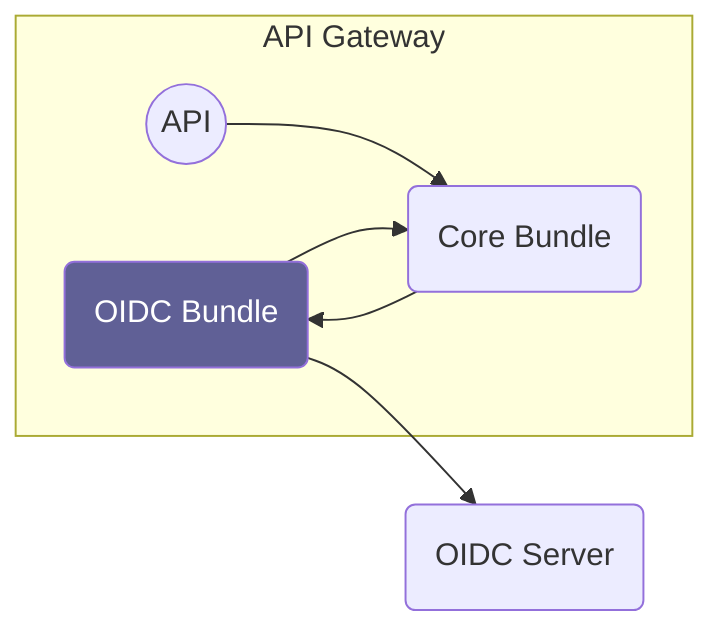

# Overview

Source: https://github.com/digital-blueprint/relay-core-connector-oidc-bundle

The OIDC bundle connects the core bundle with an OIDC server. For each request
it validates the passed access token, creates a Symfony user and assigns Symfony
roles to that user.

## Documentation

* [Configuration](./config.md)
* [Custom Roles Mapping](./roles.md)
